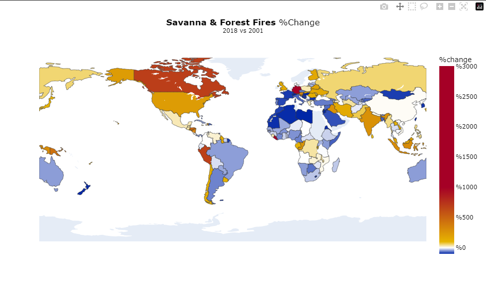

# 🌍 Climate Change-DataAnalysis

## Overview
This repository hosts a collection of data analysis projects focused on critical environmental issues, including 🌱 CO2 emissions, 🌳 land and forest cover changes, and 🌡️ global temperature trends. Utilizing advanced data visualization techniques, these analyses aim to provide insights into the impacts of climate change.

## Projects
1. **CO2 Emissions Analysis** 🌬️
   - Analyzes and visualizes CO2 emissions for major countries in 2019.
   - Highlights contributions from different energy sectors.

   

2. **Land and Forest Cover Changes** 🌲
   - Examines tree-covered areas and forest fire impacts between 2001 and 2018.
   - Uses choropleth maps for visual representation of percentage changes.

   

3. **Temperature Change Analysis** 📈
   - Investigates trends in temperature changes over time.
   - Provides a descriptive overview of temperature data.

   

## Technologies Used 🔧
- **Python Libraries**: Pandas, NumPy, Plotly, Seaborn, Matplotlib
- **Data Sources**: [data source](./data.csv)

