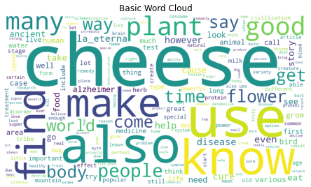

# 📊 Text-Insight: LDA Topic Modeling

Dive deep into topic discovery from textual data using Latent Dirichlet Allocation (LDA). Unveil hidden themes in large text corpora and visualize them with interactive word clouds! 🌐🔍

## 🚀 Project Overview
This project performs **topic modeling** on text datasets using the **LDA** algorithm to extract hidden themes from the text. You can visualize topics as word clouds to get a quick sense of the patterns in your data!

## ⚙️ Features
- 🔢 **LDA Topic Modeling** to extract topics from text data.
- 🌈 **Wordcloud visualization** for an easy, visual understanding of each topic.
- 📊 **Interactive insights** from textual datasets with clear visualization.

## 📂 Dataset
The data used for this project is available [here](#). Feel free to explore it and analyze your own datasets!

