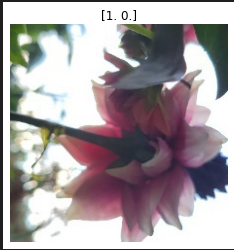
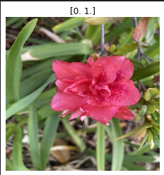

# VisionAI-ImageAnalyzer 🖼️🔍

Welcome to **VisionAI-ImageAnalyzer**, a deep learning-based image classification and analysis project built using TensorFlow and Keras. The project utilizes **VGG19**, a state-of-the-art convolutional neural network, to classify images after preprocessing with OpenCV.

## 🚀 Features
- **Image preprocessing** using OpenCV for tasks like resizing, normalization, and augmentation.
- **VGG19 model architecture** for feature extraction and classification, with options for fine-tuning.
- **Transfer Learning**: Use of pre-trained VGG19 weights with additional custom layers for specific image datasets.
- **Data augmentation** and split into training/validation sets using TensorFlow's `ImageDataGenerator`.
- **Model performance visualization**: Graphs for accuracy, loss, and predictions using `matplotlib`.

## 📚 Models Used
1. **VGG19**: A deep convolutional network with 19 layers, pre-trained on ImageNet. Used for feature extraction and classification.
2. **Custom Model Layers**:
   - Flatten and dense layers added on top of VGG19 for task-specific classification.
   - **Dropout layers** to reduce overfitting.
   - **Dense layers** with softmax activation for multi-class classification.
     
## 🌸 Sample Image Showcase

Here’s a showcase of some sample images used in the project for classification:

### 1. **Magnolia Campbelli** 🌸
Magnolia Campbelli is a beautiful flowering tree known for its stunning blooms.
- **Image 1**:
- 
- **Image 2**:
- .png)

### 2. **Other Flowers** 🌼
We’ve also used a variety of other flower species in the dataset for classification.
- **Image 1**:
-  
- **Image 2**:
- .png)

These images were used to train and evaluate the model’s ability to distinguish between different flower species.

## 📊 Datasets

1. **Training and Validation Dataset**:
   - **Source**: The dataset which contains various flower species, including Magnolia Campbelli and other types is in [here](./data_cleaned).

2. **Final Output Dataset**:
   - The final output dataset which contains classified images with labels is in [here](./output_data.csv)
 

