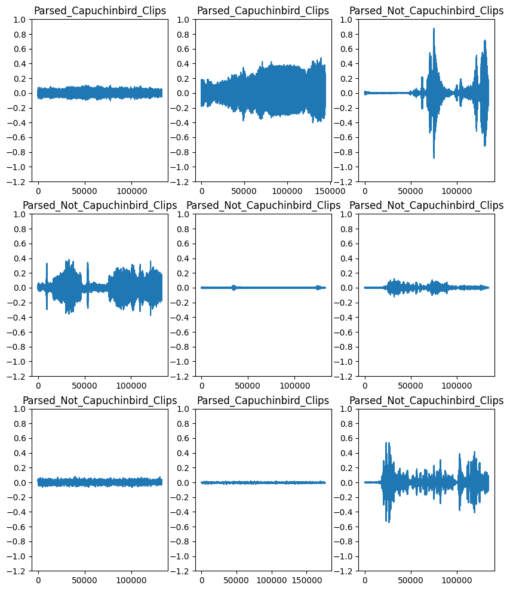
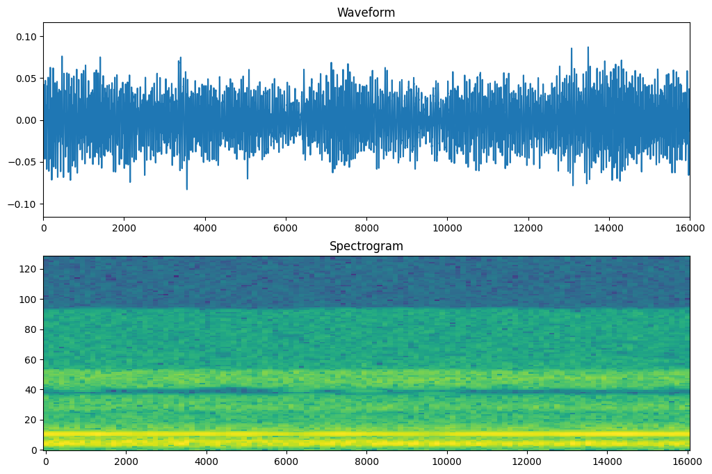
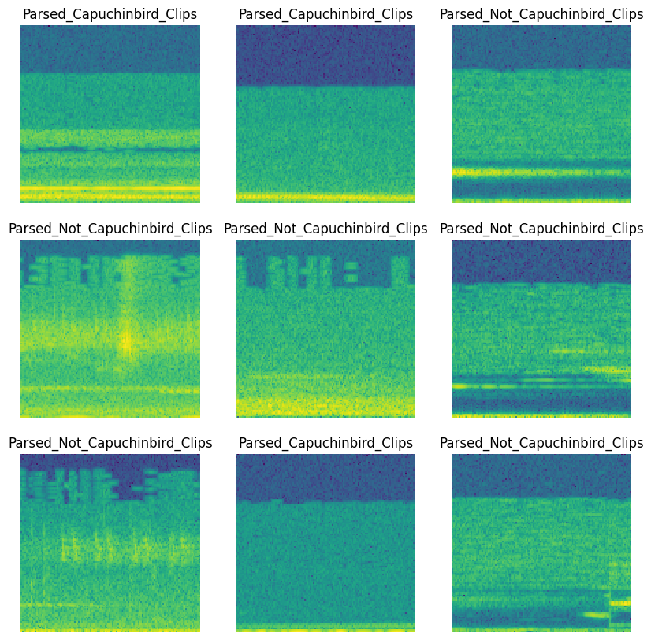
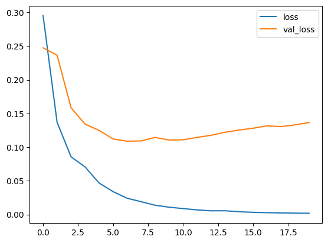

# Capuchinbird-sound-analysis 🐦

## 🎯 Project Overview
[Audio_analysis(1).ipynb](https://github.com/nasim-raj-laskar/DataVis-InsightHub/blob/main/capuchinbird-sound-analysis/Audio_analysis%20(1).ipynb) is an audio-based machine learning project focused on detecting Capuchinbird calls amidst diverse environmental noise. Utilizing spectrogram analysis, YAMNet embeddings, and transfer learning, this project builds an effective classification model to distinguish Capuchinbird calls from other noises.

## 🚀 Features
- #### 🎵 Preprocessing Methods:
  - White Noise Addition
  - Volume Normalization
  - High/Low-Frequency Filtering
- #### 📊 Audio Transformation:
  - Waveform to Spectrogram Conversion
  - STFT Spectrogram Analysis
  - Visualization of Spectrograms and Predictions
- #### 🧠 Machine Learning Models:
  - CNN Model: Trained from scratch to classify audio spectrograms.
  - YAMNet-based Transfer Learning: Leverages Google’s YAMNet embeddings for efficient audio classification.
- #### 📈 Model Evaluation:
  - Performance visualization with loss & accuracy plots.
  - Confusion Matrix Analysis.
## 📷 Visuals
To help understand the data and preprocessing steps, here are some key visuals from the project:

### 1.Raw Audio Waveforms

_This plot showcases the raw waveforms of different audio samples, providing a view of the initial audio structure before preprocessing._

### 2.Waveform and Spectrogram

_Illustrates the transformation of an audio waveform into its corresponding spectrogram, highlighting how frequency components evolve over time._

### 3.Spectrograms of Various Samples

_A grid of spectrograms from different samples, showing distinct audio frequency patterns that help in identifying Capuchinbird calls._

## 📊 Results
- Test Accuracy: 97%
- Loss curve.
  _loss_
- 

## 🛠️ Technologies Used
- Python
- TensorFlow & Keras
- YAMNet
- pydub
- Seaborn & Matplotlib
